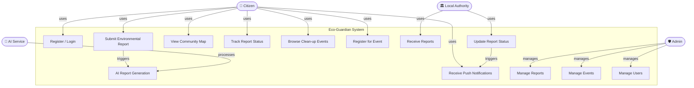
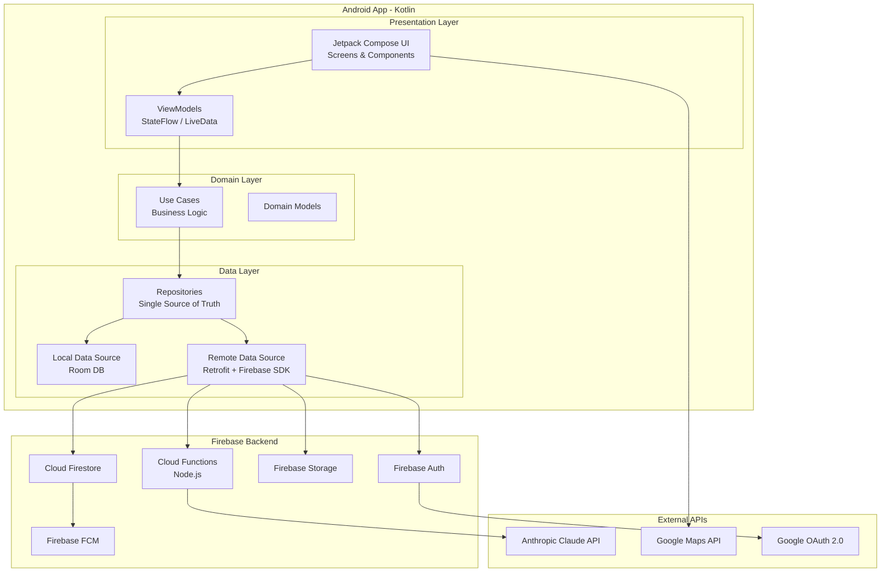
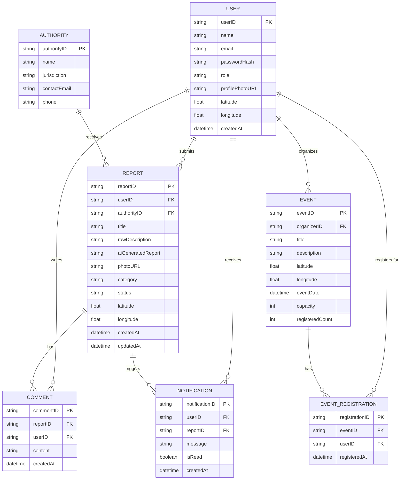
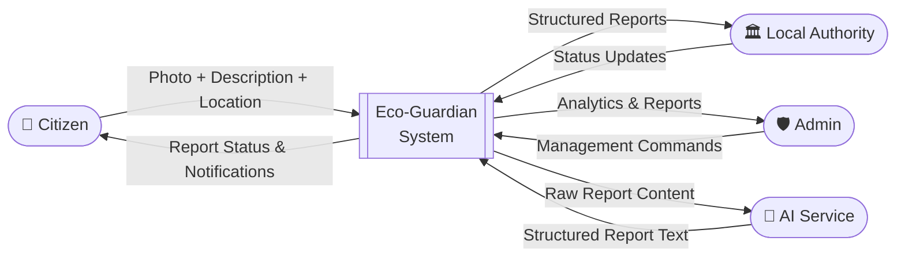
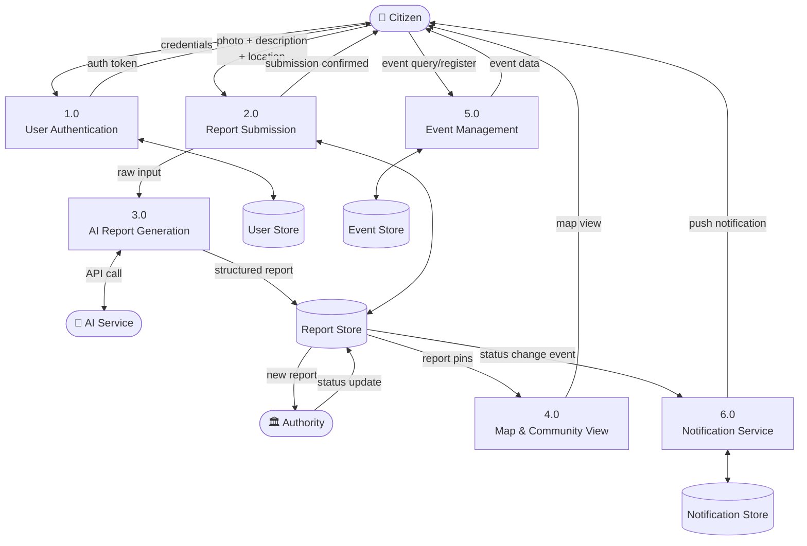
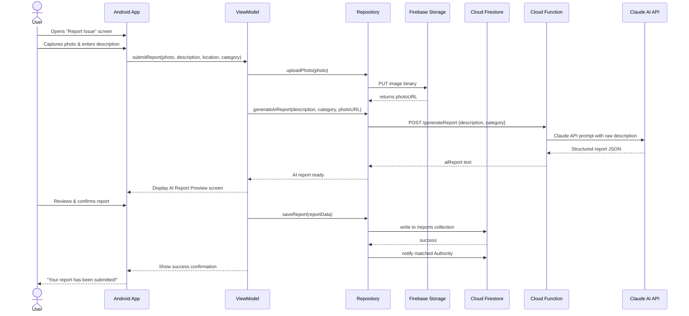
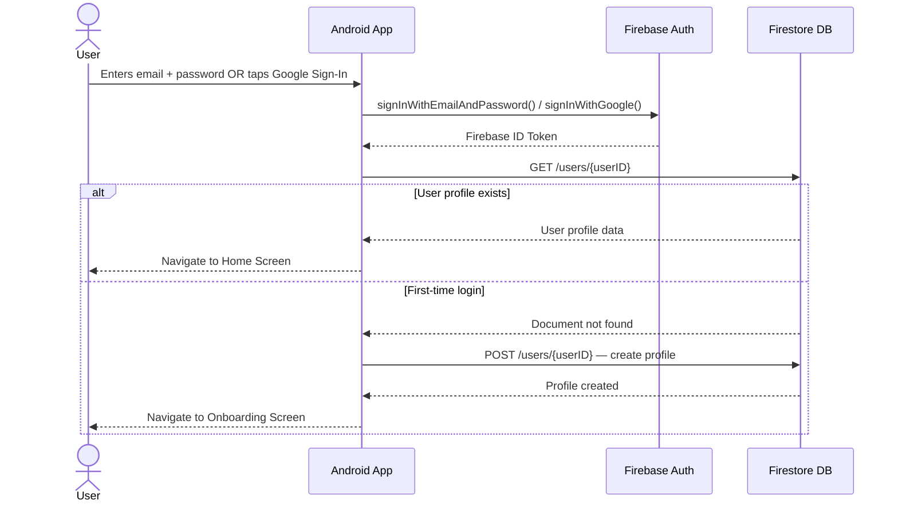
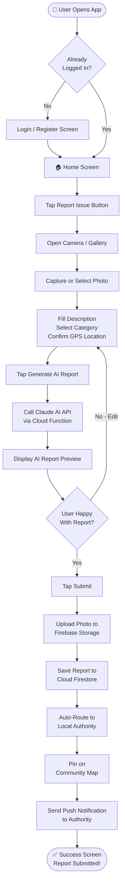
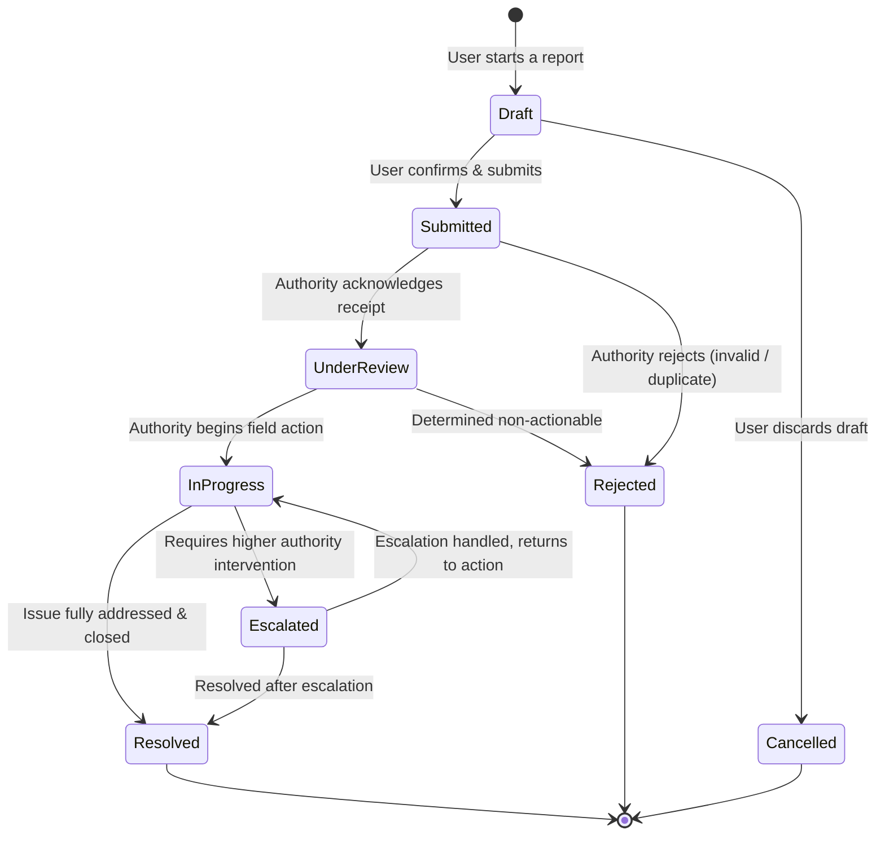
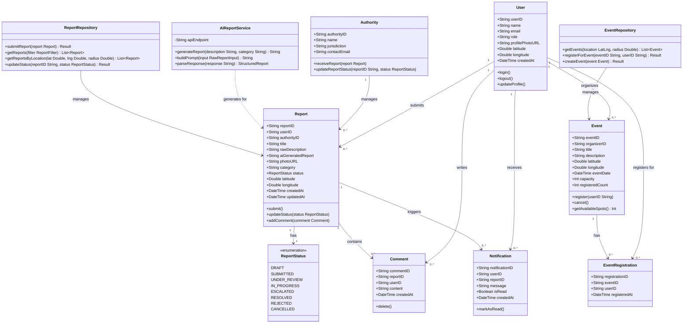

## 2. Use Case Diagram & Descriptions

### Actors

|Actor|Description|
|---|---|
|**Citizen (User)**|Primary app user; reports issues, views map, attends events|
|**Admin**|Platform manager; oversees reports, users, and events|
|**Local Authority**|Receives reports and updates their resolution status|
|**AI Service (Claude)**|External API that transforms raw descriptions into structured reports|

### Use Case Diagram

### Use Case Descriptions

|ID|Use Case|Actor|Description|
|---|---|---|---|
|UC1|Register / Login|Citizen|User creates account or logs in via email or Google OAuth|
|UC2|Submit Environmental Report|Citizen|Capture photo, enter description, select category & GPS location|
|UC3|AI Report Generation|AI Service|Transforms raw citizen input into a structured, authority-ready report|
|UC4|View Community Map|Citizen|Browse geo-pinned reports around the user's neighbourhood|
|UC5|Track Report Status|Citizen|Monitor report lifecycle from SUBMITTED → RESOLVED|
|UC6|Browse Clean-up Events|Citizen|View upcoming community events by location and date|
|UC7|Register for Event|Citizen|Sign up to attend a clean-up event|
|UC8|Receive Notifications|Citizen|Get push notifications when report status changes|
|UC9|Manage Reports|Admin|Review, approve, escalate, or close reports|
|UC10|Manage Events|Admin|Create, edit, or cancel community events|
|UC11|Manage Users|Admin|View, suspend, or remove user accounts|
|UC12|Receive Reports|Local Authority|View incoming structured reports within their jurisdiction|
|UC13|Update Report Status|Local Authority|Change report status as investigation proceeds|

---

###  Software Architecture Diagram

---

## 5. Database Design & Data Modeling

### ER Diagram

### Logical Schema (Key Tables)

**USER** (`userID` PK, `name`, `email`, `passwordHash`, `role` [citizen|admin|authority], `profilePhotoURL`, `latitude`, `longitude`, `createdAt`)

**REPORT** (`reportID` PK, `userID` FK → USER, `authorityID` FK → AUTHORITY, `title`, `rawDescription`, `aiGeneratedReport`, `photoURL`, `category` [dumping|pollution|litter|other], `status` [draft|submitted|under_review|in_progress|escalated|resolved|rejected], `latitude`, `longitude`, `createdAt`, `updatedAt`)

**AUTHORITY** (`authorityID` PK, `name`, `jurisdiction`, `contactEmail`, `phone`)

**EVENT** (`eventID` PK, `organizerID` FK → USER, `title`, `description`, `latitude`, `longitude`, `eventDate`, `capacity`, `registeredCount`)

**EVENT_REGISTRATION** (`registrationID` PK, `eventID` FK → EVENT, `userID` FK → USER, `registeredAt`)

**NOTIFICATION** (`notificationID` PK, `userID` FK → USER, `reportID` FK → REPORT, `message`, `isRead`, `createdAt`)

**COMMENT** (`commentID` PK, `reportID` FK → REPORT, `userID` FK → USER, `content`, `createdAt`)

---

## 6. Data Flow & System Behavior

### 6.1 Context-Level DFD (Level 0)

### 6.2 Level 1 DFD

### 6.3 Sequence Diagram — Report Submission Flow

### 6.4 Sequence Diagram — User Authentication Flow

### 6.5 Activity Diagram — End-to-End Report Submission

### 6.6 State Diagram — Report Lifecycle

### 6.7 Class Diagram

---
