# System Analysis & Design — Eco-Guardian

---

## 1. Actors

| Actor | Description |
|---|---|
| **Citizen (User)** | Primary app user — reports issues, views the community map, tracks report status |
| **AI Service (Gemini 2.5 Flash)** | External API that transforms raw citizen descriptions into formally structured, authority-ready report drafts |

> **Local Authority:** No direct system integration in MVP. The AI generates a professionally structured report the citizen can forward to the relevant authority via their preferred channel (email, portal, etc.).

> **Admin:** There is no admin screen in the app. Platform administration is handled directly via the **Firebase Console**.

---

## 2. Use Case Diagram

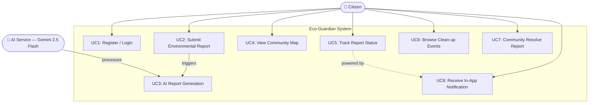

### Use Case Descriptions

| ID | Use Case | Actor | Description |
|---|---|---|---|
| UC1 | Register / Login | Citizen | Create account or sign in via email/password or Google OAuth |
| UC2 | Submit Environmental Report | Citizen | Capture photo, enter description, confirm GPS location, generate AI draft, review, and submit |
| UC3 | AI Report Generation | AI Service | Gemini 2.5 Flash transforms raw citizen input into a structured, authority-ready report draft |
| UC4 | View Community Map | Citizen | Browse geo-pinned submitted reports on a live Google Map |
| UC5 | Track Report Status | Citizen | Monitor the lifecycle of submitted reports from Submitted to Resolved |
| UC6 | Browse Clean-up Events | Citizen | View upcoming community clean-up events by location and date — **read-only** |
| UC7 | Community Resolve Report | Citizen | Nearby citizen marks a report as resolved with an optional follow-up photo — requires GPS proximity check |
| UC8 | Receive In-App Notification | Citizen | Notified via Firestore real-time listener when their report status changes |

---

## 3. Software Architecture Diagram

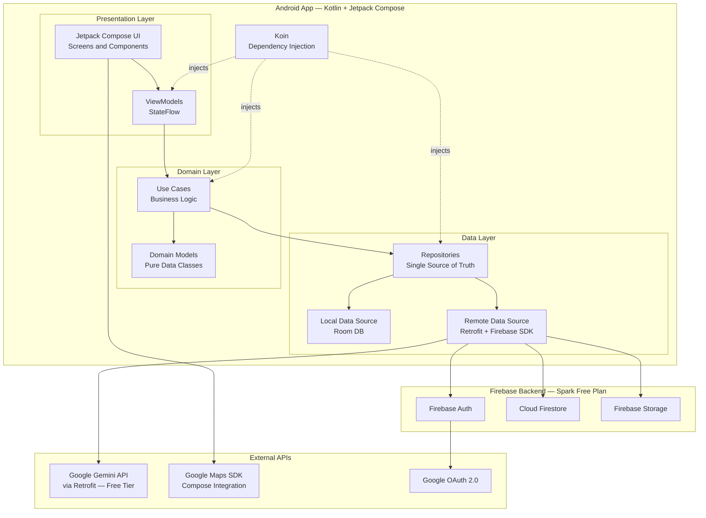

> **Notes:**
> - `UI --> GMaps` — the Google Maps composable renders in the UI layer but **all map data (pins, camera position) is supplied by the ViewModel via StateFlow**. The UI fetches nothing directly.
> - **Gemini API** is called via Retrofit from the Data layer. The key is obtained free from Google AI Studio — no credit card required. Key stored in `local.properties`, never committed to Git, accessed via `BuildConfig`.
> - **Room** caches offline report drafts so user input is never lost if the network drops mid-submission.
> - **No Cloud Functions** — the entire backend is driven by the Firebase SDK and direct Retrofit calls.

---

## 4. Database Design & Data Modelling

### ER Diagram

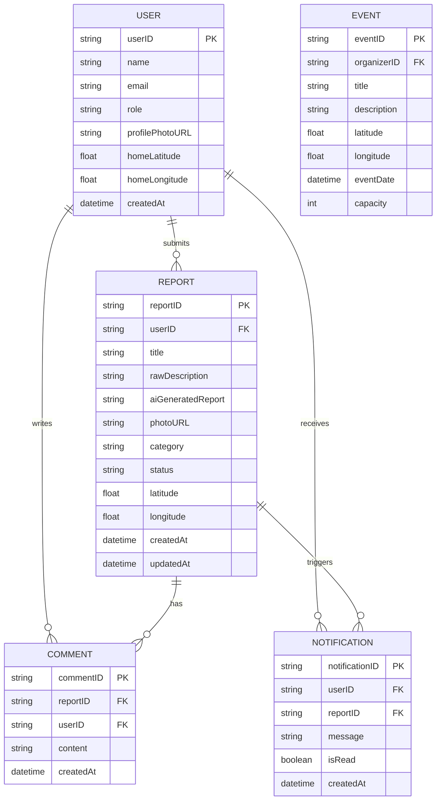

### Logical Schema

**USER** (`userID` PK, `name`, `email`, `role` [citizen | admin], `profilePhotoURL`, `homeLatitude`, `homeLongitude`, `createdAt`)

> `passwordHash` is **intentionally absent** — Firebase Authentication manages all credentials securely. Passwords must never be stored in Firestore.
> `homeLatitude` / `homeLongitude` store the user's **saved home location preference** (FR-22), not their real-time GPS position.

---

**REPORT** (`reportID` PK, `userID` FK → USER, `title`, `rawDescription`, `aiGeneratedReport`, `photoURL`, `category` [litter | pollution | dumping | other], `status` [submitted | resolved | cancelled], `latitude`, `longitude`, `createdAt`, `updatedAt`)

> The AI generates a formally structured, authority-ready report draft. The citizen may forward this to the relevant local authority via their preferred channel. No direct authority system integration exists in MVP.

---

**EVENT** (`eventID` PK, `organizerID` FK → USER, `title`, `description`, `latitude`, `longitude`, `eventDate`, `capacity`)

> Events are **read-only listings** in MVP. Citizen registration for events is a future enhancement.

---

**NOTIFICATION** (`notificationID` PK, `userID` FK → USER, `reportID` FK → REPORT, `message`, `isRead`, `createdAt`)

---

**COMMENT** (`commentID` PK, `reportID` FK → REPORT, `userID` FK → USER, `content`, `createdAt`)

---

## 5. Data Flow & System Behaviour

### 5.1 Context-Level DFD (Level 0)

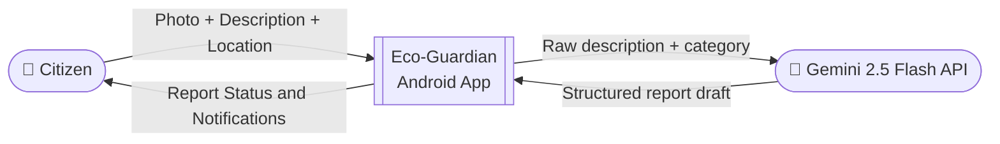

---

### 5.2 Level 1 DFD

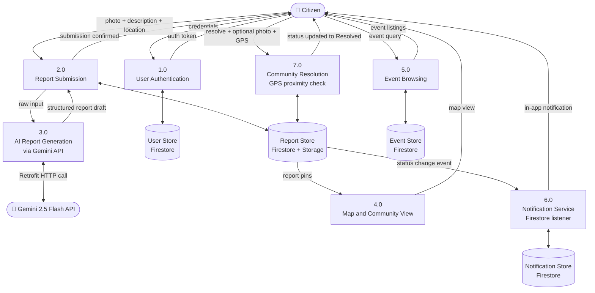

---

### 5.3 Sequence Diagram — Report Submission Flow

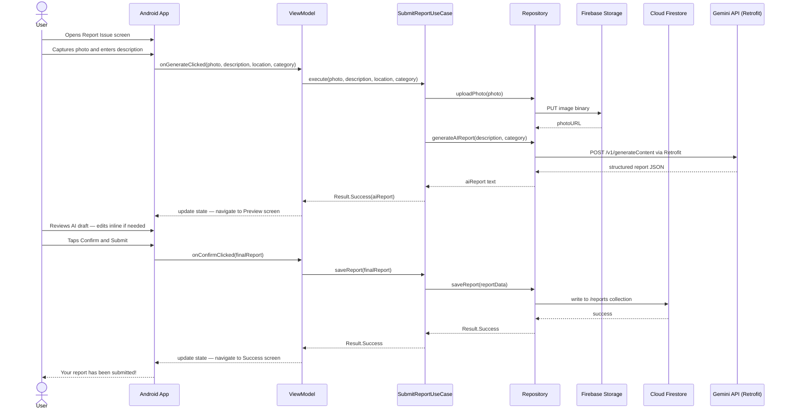

---

### 5.4 Sequence Diagram — Community Resolution Flow

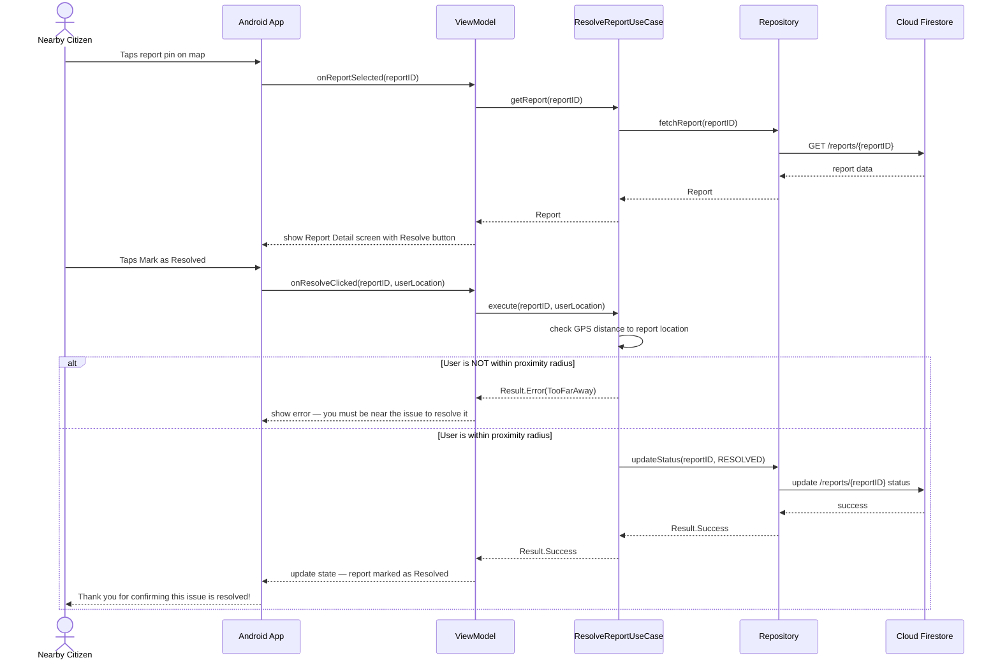

---

### 5.5 Sequence Diagram — User Authentication Flow

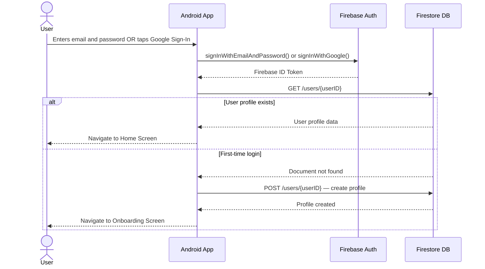

---

### 5.6 Activity Diagram — End-to-End Report Submission

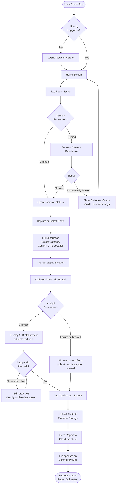

---

### 5.7 State Diagram — Report Lifecycle

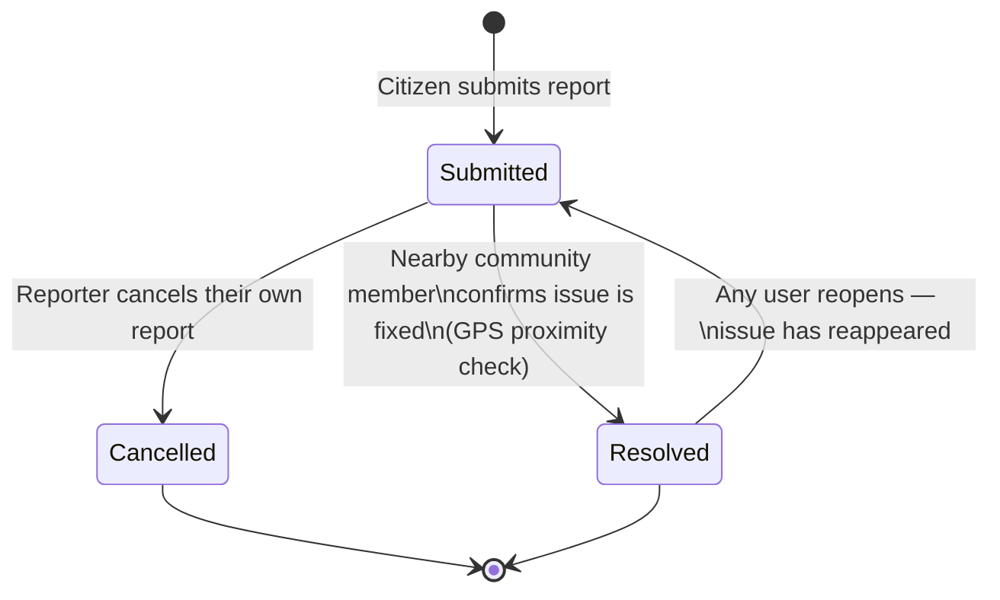

---

### 5.8 Class Diagram

> **Design rule:** Domain models are **pure data classes** — they hold state only. All operations live in **Use Cases** and **Repositories**.

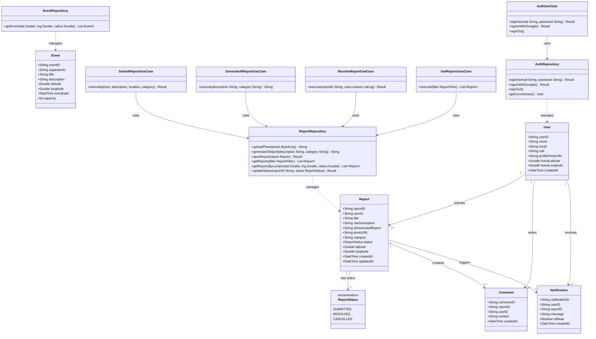
